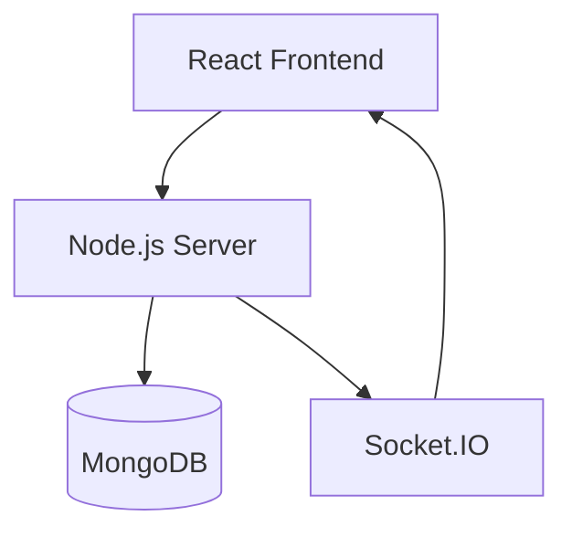
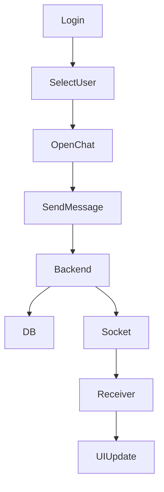
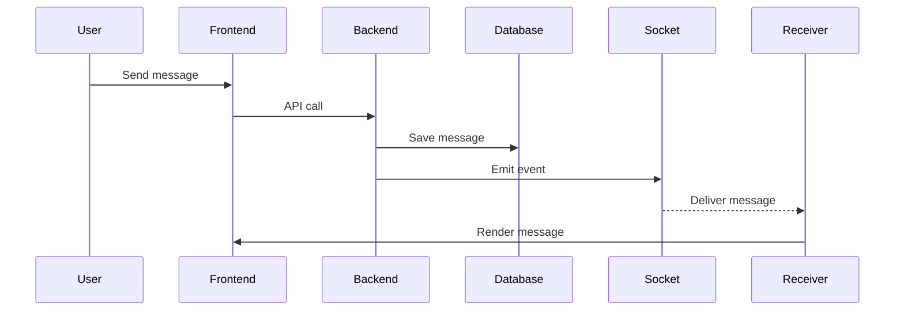

# 💬 ChatFlow Web — Full Stack WhatsApp Web Clone

A full-stack real-time chat application inspired by WhatsApp Web, built to demonstrate scalable architecture, real-time communication, and clean code practices.

> Developed as part of a full-stack evaluation task focusing on practical implementation, clarity, and system design.

---

## 📖 Overview

**Purpose**
To build a real-time communication platform that mimics the core experience of WhatsApp Web.

**What was built**

- Real-time messaging system using WebSockets
- Persistent chat storage with MongoDB
- Clean, modular frontend architecture
- Media/file messaging support

**Focus Areas**

- Real-time synchronization
- Full-stack integration
- Clean and maintainable structure

---

## ✅ Task Requirement Mapping

### 1. User Setup

- Username-based authentication
- Unique user identification (MongoDB ObjectId)
- Multi-user chat capability

### 2. Chat Interface

- Two-panel layout (Chat List + Chat Window)
- Active chat highlighting
- Sender vs receiver message styling
- Auto-scroll to latest message

### 3. Messaging Functionality

- Send/receive text and media messages
- Messages stored in MongoDB
- Chat history persistence after refresh
- Chronological ordering
- Metadata: senderId, receiverId, timestamp

### 4. Backend APIs

- POST /api/auth → Create/Login user
- GET /api/users → Fetch users
- POST /api/messages → Send message
- GET /api/messages/:chatId → Get messages

### 5. Real-Time Updates

- Implemented using Socket.IO
- Instant message delivery
- Live UI updates without refresh

### 6. Application Structure

- Separate frontend and backend
- Modular folder structure
- Reusable React components
- Service-based backend logic

---

## ✨ Features

### 🔥 Core Features

- Real-time messaging (Socket.IO)
- Persistent chat storage (MongoDB)
- File/media sharing (images, videos, docs)
- Message status:
  - Sent
  - Delivered
  - Seen

### 🚀 Extended Features

- Notifications panel
- Status UI (prototype)
- File preview modal
- Message forwarding (UI)
- Delete message functionality

---

## 🧰 Tech Stack

| Layer             | Technology                         |
| ----------------- | ---------------------------------- |
| Frontend          | React (Vite)                       |
| State Management  | Context API                        |
| Styling / UI      | CSS / Custom Styling               |
| Backend           | Node.js + Express                  |
| Real-Time         | Socket.IO (WebSockets)             |
| Database          | MongoDB (Mongoose)                 |
| API Communication | Axios (HTTP Requests)              |
| File Handling     | Multer (File Uploads)              |
| Authentication    | Basic Auth (Username-based / JWT*) |
| Deployment Ready  | Localhost (Extendable to Cloud)    |

---

## 🧠 System Architecture



---


## 🔄 Application Flow



---


## 🔁 Message Flow




---

## 📂 Project Structure

```bash
Chatflow-web/
├── client/                # React Frontend
│   ├── src/
│   │   ├── components/    # UI Components
│   │   ├── context/       # State Management
│   │   ├── pages/         # Screens (Chat, Login)
│   │   ├── services/      # API Calls
│   │   ├── socket/        # Socket.IO Client
│   │   └── App.jsx
│   └── package.json
│
├── server/                # Node.js Backend
│   ├── controllers/       # Request Handlers
│   ├── models/            # MongoDB Schemas
│   ├── routes/            # API Routes
│   ├── services/          # Business Logic
│   ├── sockets/           # Socket Events
│   ├── config/            # DB Configuration
│   ├── uploads/           # Media Files
│   └── server.js
│
├── .gitignore
└── README.md
```
---

## ⚙️ Environment Setup

### Backend (server/.env)
Create a .env file inside server/ folder:
```bash
PORT=5000
MONGO_URI=your_mongodb_uri
NODE_ENV=development
```
---

## 🧩 Database Setup (MongoDB Atlas)

Follow the steps below to configure MongoDB Atlas for this project:


### 🚀 Step 1: Create a MongoDB Atlas Account

* Go to: https://www.mongodb.com/atlas
* Sign up or log in

---

### 📁 Step 2: Create a Project

* Click **"New Project"**
* Enter a project name
* Click **Next → Create Project**

---

### 🗄️ Step 3: Create a Cluster

* Click **"Create Cluster"**
* Select **Free Tier (M0)**
* Choose a cloud provider & region
* Enter a cluster name
* Click **Create Deployment**

---

### 🔐 Step 4: Create Database User

* Provide a **username and password**
* Save these credentials (you will need them later)

---

### 🌐 Step 5: Setup Network Access

* Go to **Network Access**
* Click **Add IP Address**
* Select **Allow Access from Anywhere (0.0.0.0/0)**

---

### 🔗 Step 6: Get Connection String

* Go to **Database → Connect**
* Select **Drivers**
* Copy the connection string

Example:

```
mongodb+srv://<username>:<password>@cluster.mongodb.net/chatflow
```

---

### ⚙️ Step 7: Configure Environment Variable

Open the backend `.env` file:
server/.env
```

Add your MongoDB connection string:

```
MONGO_URI=mongodb+srv://<username>:<password>@cluster.mongodb.net/chatflow
```

Replace:

* `<username>` → your database username
* `<password>` → your database password
```

---

### How It Works

* The backend connects to MongoDB using `MONGO_URI`
* Collections are created automatically when the app runs
* No manual database setup is required

---

### ⚠️ Important Notes

* Do NOT share your MongoDB credentials publicly
* Ensure `.env` is added to `.gitignore`
* Backend will fail if connection string is invalid

---

## 🚀 How to Run

### Backend
```bash
cd server
npm install
npm run dev
```

### Frontend:
```bash
cd client
npm install
npm run dev
```

---

## 📡 API Endpoints

- POST /api/auth
- GET /api/users
- POST /api/messages
- GET /api/messages/:chatId

---

## 📸 Media Handling

- Files stored in /uploads
- Supports images, videos, documents

---

## 🚧 Future Improvements

- Group chats
- Online/offline presence
- Push notifications
- Cloud storage
- End-to-end encryption

---

## 📌 Submission Note

This project was developed as part of the Humbletree Full Stack Developer Task to demonstrate:

  Full-stack development capability
  Clean architecture and structure
  Real-time system design
  Problem-solving approach under time constraints


