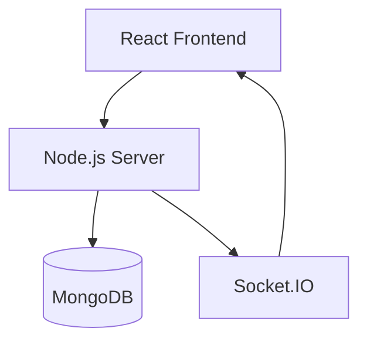
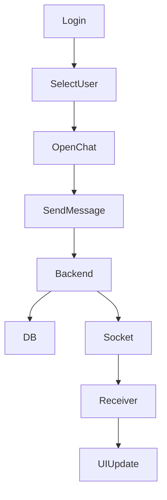
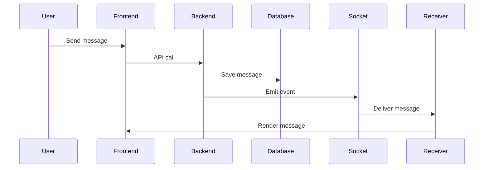

# 💬 ChatFlow Web — Full Stack WhatsApp Web Clone

A full-stack real-time chat application inspired by WhatsApp Web, built to demonstrate scalable architecture, real-time communication, and clean code practices.

> Developed as part of a full-stack evaluation task focusing on practical implementation, clarity, and system design.

---

## 📖 Overview

**Purpose**
To build a real-time communication platform that mimics the core experience of WhatsApp Web.

**What was built**

- Real-time messaging system using WebSockets
- Persistent chat storage with MongoDB
- Clean, modular frontend architecture
- Media/file messaging support

**Focus Areas**

- Real-time synchronization
- Full-stack integration
- Clean and maintainable structure

---

## ✅ Task Requirement Mapping

### 1. User Setup

- Username-based authentication
- Unique user identification (MongoDB ObjectId)
- Multi-user chat capability

### 2. Chat Interface

- Two-panel layout (Chat List + Chat Window)
- Active chat highlighting
- Sender vs receiver message styling
- Auto-scroll to latest message

### 3. Messaging Functionality

- Send/receive text and media messages
- Messages stored in MongoDB
- Chat history persistence after refresh
- Chronological ordering
- Metadata: senderId, receiverId, timestamp

### 4. Backend APIs

- POST /api/auth → Create/Login user
- GET /api/users → Fetch users
- POST /api/messages → Send message
- GET /api/messages/:chatId → Get messages

### 5. Real-Time Updates

- Implemented using Socket.IO
- Instant message delivery
- Live UI updates without refresh

### 6. Application Structure

- Separate frontend and backend
- Modular folder structure
- Reusable React components
- Service-based backend logic

---

## ✨ Features

### 🔥 Core Features

- Real-time messaging (Socket.IO)
- Persistent chat storage (MongoDB)
- File/media sharing (images, videos, docs)
- Message status:
  - Sent
  - Delivered
  - Seen

### 🚀 Extended Features

- Notifications panel
- Status UI (prototype)
- File preview modal
- Message forwarding (UI)
- Delete message functionality

---

## 🧰 Tech Stack

| Layer             | Technology                         |
| ----------------- | ---------------------------------- |
| Frontend          | React (Vite)                       |
| State Management  | Context API                        |
| Styling / UI      | CSS / Custom Styling               |
| Backend           | Node.js + Express                  |
| Real-Time         | Socket.IO (WebSockets)             |
| Database          | MongoDB (Mongoose)                 |
| API Communication | Axios (HTTP Requests)              |
| File Handling     | Multer (File Uploads)              |
| Authentication    | Basic Auth (Username-based / JWT*) |
| Deployment Ready  | Localhost (Extendable to Cloud)    |

---

## 🧠 System Architecture

---

## 🔄 Application Flow

---

## 🔁 Message Flow

---

## 📂 Project Structure

Chatflow-web/
├── client/ (React frontend)
├── server/ (Node.js backend)
└── README.md

### Frontend

client/src/

- components/
- context/
- pages/
- services/
- socket/

### Backend

server/

- controllers/
- models/
- routes/
- services/
- sockets/
- uploads/

---

## ⚙️ Environment Setup

### Backend (server/.env)

PORT=5000
MONGO_URI=your_mongodb_uri
NODE_ENV=development

---

## ▶️ Run Locally

Backend:
cd server
npm install
npm run dev

Frontend:
cd client
npm install
npm run dev

---

## 📡 API Endpoints

- POST /api/auth
- GET /api/users
- POST /api/messages
- GET /api/messages/:chatId

---

## 📸 Media Handling

- Files stored in /uploads
- Supports images, videos, documents

---

## 🚧 Future Improvements

- Group chats
- Online/offline presence
- Push notifications
- Cloud storage
- End-to-end encryption

---

## 🎯 Design Philosophy

- Keep it simple
- Avoid overengineering
- Focus on clarity

---

## 📌 Submission Note

This project demonstrates:

- Full-stack development
- Real-time systems
- Clean architecture

---

## 👤 Author

Sanjee (Sanjeetha S)
Kumaraguru College of Technology
